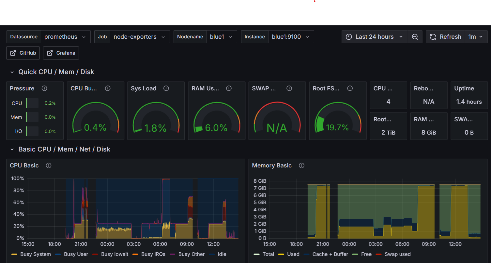

# Monitoring Raspberry Pi HPC Cluster with Prometheus & Grafana

This guide explains how to set up **Prometheus** and **Grafana** to monitor your Raspberry Pi HPC cluster.

Cluster layout:
* **hpc_master** &rarr; runs Prometheus and Grafana (central monitoring).
* **Compute nodes** &rarr; run Node Exporter.

This setup allows you to track **CPU, memory, disk, and network performance** across the entire cluster from a single Grafana dashboard.

---

## Step 1: Update the HPC_Master Node

On the **hpc_master node**, update your packages before installing Prometheus:

```
sudo apt update && sudo apt upgrade -y
```

---

## Step 2: Install Prometheus on the hpc_master Node

Prometheus will be installed only on the **hpc_master node** (it scrapes metrics from the other nodes).

### 2.1 Create a Prometheus User

For security, create a dedicated system user on the **hpc_master node**:

```
sudo useradd --no-create-home --shell /bin/false prometheus
```

### 2.2 Create Directories

Prometheus needs folders for configuration and data:

```
sudo mkdir /etc/prometheus
sudo mkdir /var/lib/prometheus
sudo chown prometheus:prometheus /etc/prometheus /var/lib/prometheus
```

### 2.3 Download Prometheus

Check [Prometheus Downloads](https://prometheus.io/download/) for the latest version.
As of **August 2025**, the stable release is `3.4.1`.

Download and extract on the **hpc_master node**:

```
wget https://github.com/prometheus/prometheus/releases/download/v3.4.1/prometheus-3.4.1.linux-arm64.tar.gz
tar xvf prometheus-3.4.1.linux-arm64.tar.gz
cd prometheus-3.4.1.linux-arm64
```
*(Note: use the `arm64` release since Raspberry Pi is ARM-based.)*

### 2.4 Move Binaries and Configs

Install Prometheus and set ownership:

```
sudo cp prometheus promtool /usr/local/bin/
sudo cp -r consoles console_libraries /etc/prometheus/
sudo cp prometheus.yml /etc/prometheus/
sudo chown -R prometheus:prometheus /etc/prometheus
```

### 2.5 Create Prometheus Systemd Service

Set up Prometheus as a service on the **hpc_master node**:

```
sudo nano /etc/systemd/system/prometheus.service
```

Paste the following:

```
[Unit]
Description=Prometheus Monitoring for HPC Cluster
Wants=network-online.target
After=network-online.target

[Service]
User=prometheus
Group=prometheus
Type=simple
ExecStart=/usr/local/bin/prometheus \
    --config.file /etc/prometheus/prometheus.yml \
    --storage.tsdb.path=/var/lib/prometheus/ \
    --web.console.templates=/etc/prometheus/consoles \
    --web.console.libraries=/etc/prometheus/console_libraries

[Install]
WantedBy=multi-user.target
```

Save and exit (`Ctrl+O`, `Enter`, `Ctrl+X`).

### 2.6 Start and Enable Prometheus

Enable Prometheus on the **hpc_master node**:

```
sudo systemctl daemon-reload
sudo systemctl start prometheus
sudo systemctl enable prometheus
```

Check the service status:

```
systemctl status prometheus
```

By default, Prometheus is available at:
👉 `http://<hpc_master-node-ip>:9090`

## Step 3: Install Node Exporter on All Nodes

Prometheus is great, but it needs exporters to collect system-level metrics like CPU, memory, and disk stats.
We’ll install **Node Exporter** on  **all compute nodes**

This way, Prometheus (on the hpc_master node) can scrape metrics from every machine in the cluster.

### 3.1 Download Node Exporter

On each cluster node (master + compute), download the ARM build:

```
wget https://github.com/prometheus/node_exporter/releases/download/v1.9.1/node_exporter-1.9.1.linux-arm64.tar.gz
tar xvf node_exporter-1.9.1.linux-arm64.tar.gz
sudo cp node_exporter-1.9.1.linux-arm64/node_exporter /usr/local/bin/
```

### 3.2 Create a User

Still on each node:

```
sudo useradd --no-create-home --shell /bin/false node_exporter
sudo chown node_exporter:node_exporter /usr/local/bin/node_exporter
```

### 3.3 Create Systemd Service

On each node, create the service file:

```
sudo nano /etc/systemd/system/node_exporter.service
```

Paste:

```
[Unit]
Description=Node Exporter
Wants=network-online.target
After=network-online.target

[Service]
User=node_exporter
Group=node_exporter
Type=simple
ExecStart=/usr/local/bin/node_exporter

[Install]
WantedBy=multi-user.target
```

Start and enable the service:

```
sudo systemctl daemon-reload
sudo systemctl start node_exporter
sudo systemctl enable node_exporter
```

Node Exporter now runs on port `9100` on each node.

### 3.4 Configure Prometheus to Scrape All Nodes

Now go back to the **hpc_master node** and edit:

```
sudo nano /etc/prometheus/prometheus.yml
```

Under `scrape`, add all your nodes (replace with your actual IPs or hostnames):

```
- job_name: 'hpc_cluster_nodes'
  static_configs:
    - targets: ['red1:9100', 'red2:9100', 'red3:9100', 'red4:9100', 'red5:9100', 'red6:9100', 'red7:9100', 'red8:9100', 'blue1:9100', 'blue2:9100', 'blue3:9100', 'blue4:9100', 'blue5:9100', 'blue6:9100', 'blue7:9100', 'blue8:9100']
```

Restart Prometheus:

```
sudo systemctl restart prometheus
```

Prometheus will now scrape metrics from **all compute nodes**.

---

## Step 4: Install Grafana on the hpc_master Node

Grafana will be our visualization tool. Install it only on the **hpc_master node**.

### 4.1 Add Grafana Repository

On the hpc_master node add the Grafana Repository according to the official [docs](https://grafana.com/docs/grafana/latest/setup-grafana/installation/debian/):

```
sudo apt-get install -y apt-transport-https software-properties-common wget
sudo mkdir -p /etc/apt/keyrings/
wget -q -O - https://apt.grafana.com/gpg.key | gpg --dearmor | sudo tee /etc/apt/keyrings/grafana.gpg > /dev/null
echo "deb [signed-by=/etc/apt/keyrings/grafana.gpg] https://apt.grafana.com stable main" | sudo tee -a /etc/apt/sources.list.d/grafana.list
```

### 4.2 Install Grafana

```
sudo apt update
sudo apt install grafana -y
```

### 4.3 Start Grafana

```
sudo systemctl start grafana-server
sudo systemctl enable grafana-server
```

## Step 4.4: Access Grafana from Your Laptop

Since Grafana is running on **hpc_master**, but your laptop cannot directly reach it, you need to use **SSH port forwarding**.

From your **laptop**, run this command:

```
ssh -L 3000:master:3000 login
```

* `-L 3000:master:3000` &rarr; forwards your laptop’s port `3000` to `master:3000` through the login node.
* `login` &rarr; the SSH host you normally use to connect to the cluster login node.

Keep this SSH session open.
Now, on your **laptop browser**, go to:

[http://localhost:3000](http://localhost:3000)

You should see the Grafana login screen.

Default credentials:

* **Username:** admin
* **Password:** admin

Grafana will prompt you to change the password after the first login.

## Step 5: Connect Grafana to Prometheus

### 5.1 Add Prometheus as a Data Source

* In Grafana, click the **gear icon** &rarr; *Configuration* &rarr; *Data Sources* &rarr; *Add data source*.
* Choose **Prometheus**.
* Set the URL to:

```
http://localhost:9090
```

* Click **Save & Test**. You should see "Data source is working."

### 5.2 Import a Dashboard

* In Grafana, click the **+ icon** &rarr; *Import*.
* Enter dashboard ID: **1860** (Node Exporter Full).
* Select your Prometheus data source.
* Click **Import**.

Now you’ll see a pre-built dashboard with cluster-wide metrics.

---

## Step 6: Explore and Customize

At this point you have:

* **Node Exporter** running on hpc_master and all compute nodes.
* **Prometheus** scraping metrics from all nodes.
* **Grafana** visualizing everything on the hpc_master node.

You can now:

* Add more dashboards (CPU load, memory usage, network).
* Build custom dashboards for HPC workloads.
* Set up **alerts** in Grafana (e.g. notify when a node is down or CPU > 90%).

Here is an example of our Dashboard:


## Automation with Ansible Scripts (Grafana, Prometheus & Node Exporter)

Rolling out monitoring across a Raspberry Pi HPC cluster is tedious to do by hand. To keep things consistent and repeatable, we use **Ansible playbooks** to automate installing **Prometheus + Grafana** on the **`hpc_master`** and **Node Exporter** on all **compute nodes**.

### Files used in automation

* [**prometheus_grafana.yml**](./prometheus_grafana.yml)
  Installs and configures **Prometheus** and **Grafana** on **`hpc_master`**:

  * Creates Prometheus user, directories, and systemd service
  * Downloads ARM binaries for Prometheus
  * Renders `prometheus.yml` to scrape all compute nodes (generated from inventory)
  * Adds the **updated Grafana APT repo** (keyring + `signed-by`)
  * Installs and enables `grafana-server`

* [**node_exporter.yml**](./node_exporter.yml)
  Installs and configures **Node Exporter** on **all `compute_nodes`**:

  * Creates `node_exporter` user and systemd service
  * Downloads ARM binaries for Node Exporter
  * Enables port `9100` service

* [**group_vars/all.yml**](./group_vars/all.yml)
  Central **variables** for both playbooks (versions, architectures, paths, optional extra scrape targets, Grafana repo key settings).

  * Adjust `*_arch` to `linux-arm64` or `linux-armv7` depending on your Pi OS
  * Add any **extra Prometheus targets** (e.g., `hpc_master:9100`) if you also run Node Exporter on the master

* [**templates/prometheus.service.j2**](./templates/prometheus.service.j2)
  Systemd unit template for Prometheus on `hpc_master`.

* [**templates/node_exporter.service.j2**](./templates/node_exporter.service.j2)
  Systemd unit template for Node Exporter on compute nodes.

* [**templates/prometheus.yml.j2**](./templates/prometheus.yml.j2)
  Prometheus config template that **auto-generates scrape targets** from the `compute_nodes` group in your inventory (plus any `prometheus_extra_targets`).

* [**hosts.ini**](./hosts.ini)
  The **inventory**:

  * `monitoring` group &rarr; **`hpc_master`** (Prometheus + Grafana)
  * `compute_nodes` group &rarr; all compute nodes (`red1…red8`, `blue1…blue8`)

* [**ansible.cfg**](./ansible.cfg)
  Ansible configuration. Sets default inventory and SSH key; disables host key checking for smoother automation.

### Running the playbooks

After reviewing `group_vars/all.yml` and your inventory:

```bash
# Install Node Exporter on all compute nodes
ansible-playbook monitoring_clients.yml

# Install Prometheus + Grafana on hpc_master
ansible-playbook monitoring_server.yml
```

These playbooks are **idempotent**—you can rerun them any time. If everything is already configured, nothing changes; if something drifted, Ansible fixes it.
