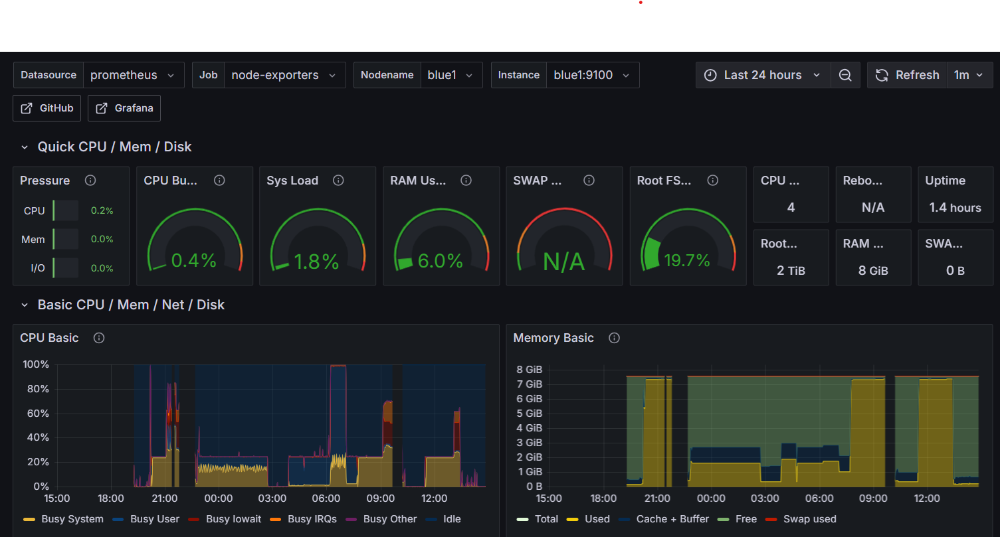

# Monitoring Raspberry Pi HPC Cluster with Prometheus & Grafana

This guide explains how to set up **Prometheus** and **Grafana** to monitor your Raspberry Pi HPC cluster.

Cluster layout:
* **hpc_master** &rarr; runs Prometheus and Grafana (central monitoring).
* **Compute nodes** &rarr; run Node Exporter.

This setup allows you to track **CPU, memory, disk, and network performance** across the entire cluster from a single Grafana dashboard.

## Table of Contents
- [Monitoring Raspberry Pi HPC Cluster with Prometheus \& Grafana](#monitoring-raspberry-pi-hpc-cluster-with-prometheus--grafana)
  - [Table of Contents](#table-of-contents)
  - [Step 1: Update the HPC\_Master Node](#step-1-update-the-hpc_master-node)
  - [Step 2: Install Prometheus on the hpc\_master Node](#step-2-install-prometheus-on-the-hpc_master-node)
    - [2.1 Create a Prometheus User](#21-create-a-prometheus-user)
    - [2.2 Create Directories](#22-create-directories)
    - [2.3 Download Prometheus](#23-download-prometheus)
    - [2.4 Move Binaries and Configs](#24-move-binaries-and-configs)
    - [2.5 Create Prometheus Systemd Service](#25-create-prometheus-systemd-service)
    - [2.6 Start and Enable Prometheus](#26-start-and-enable-prometheus)
  - [Step 3: Install Node Exporter on All Nodes](#step-3-install-node-exporter-on-all-nodes)
    - [3.1 Download Node Exporter](#31-download-node-exporter)
    - [3.2 Create a User](#32-create-a-user)
    - [3.3 Create Systemd Service](#33-create-systemd-service)
    - [3.4 Configure Prometheus to Scrape All Nodes](#34-configure-prometheus-to-scrape-all-nodes)
  - [Step 4: Install and Configure Alertmanager](#step-4-install-and-configure-alertmanager)
    - [4.1 Download and Install Alertmanager](#41-download-and-install-alertmanager)
    - [4.2 Configure Alertmanager](#42-configure-alertmanager)
    - [4.3 Create the Alertmanager Systemd Service](#43-create-the-alertmanager-systemd-service)
    - [4.4 Update Prometheus Configuration](#44-update-prometheus-configuration)
    - [4.5 Add Alert Rules](#45-add-alert-rules)
    - [4.6 (Optional) Configure Discord Notifications](#46-optional-configure-discord-notifications)
  - [Step 5: Install Grafana on the hpc\_master Node](#step-5-install-grafana-on-the-hpc_master-node)
    - [5.1 Add Grafana Repository](#51-add-grafana-repository)
    - [5.2 Install Grafana](#52-install-grafana)
    - [5.3 Start Grafana](#53-start-grafana)
    - [5.4: Access Grafana from Your Laptop](#54-access-grafana-from-your-laptop)
  - [Step 6: Connect Grafana to Prometheus](#step-6-connect-grafana-to-prometheus)
    - [6.1 Add Prometheus as a Data Source](#61-add-prometheus-as-a-data-source)
    - [6.2 Import a Dashboard](#62-import-a-dashboard)
  - [Step 7: Explore and Customize](#step-7-explore-and-customize)
  - [Automation with Ansible Scripts (Grafana, Prometheus \& Node Exporter)](#automation-with-ansible-scripts-grafana-prometheus--node-exporter)
    - [Files used in automation](#files-used-in-automation)
    - [Running the playbooks](#running-the-playbooks)


---

## Step 1: Update the HPC_Master Node

On the **hpc_master node**, update your packages before installing Prometheus:

```
sudo apt update && sudo apt upgrade -y
```

---

## Step 2: Install Prometheus on the hpc_master Node

Prometheus will be installed only on the **hpc_master node** (it scrapes metrics from the other nodes).

### 2.1 Create a Prometheus User

For security, create a dedicated system user on the **hpc_master node**:

```
sudo useradd --no-create-home --shell /bin/false prometheus
```

### 2.2 Create Directories

Prometheus needs folders for configuration and data:

```
sudo mkdir /etc/prometheus
sudo mkdir /var/lib/prometheus
sudo chown prometheus:prometheus /etc/prometheus /var/lib/prometheus
```

### 2.3 Download Prometheus

Check [Prometheus Downloads](https://prometheus.io/download/) for the latest version.
As of **August 2025**, the stable release is `3.4.1`.

Download and extract on the **hpc_master node**:

```
wget https://github.com/prometheus/prometheus/releases/download/v3.4.1/prometheus-3.4.1.linux-arm64.tar.gz
tar xvf prometheus-3.4.1.linux-arm64.tar.gz
cd prometheus-3.4.1.linux-arm64
```
*(Note: use the `arm64` release since Raspberry Pi is ARM-based.)*

### 2.4 Move Binaries and Configs

Install Prometheus and set ownership:

```
sudo cp prometheus promtool /usr/local/bin/
sudo cp -r consoles console_libraries /etc/prometheus/
sudo cp prometheus.yml /etc/prometheus/
sudo chown -R prometheus:prometheus /etc/prometheus
```

### 2.5 Create Prometheus Systemd Service

Set up Prometheus as a service on the **hpc_master node**:

```
sudo nano /etc/systemd/system/prometheus.service
```

Paste the following:

```
[Unit]
Description=Prometheus Monitoring for HPC Cluster
Wants=network-online.target
After=network-online.target

[Service]
User=prometheus
Group=prometheus
Type=simple
ExecStart=/usr/local/bin/prometheus \
    --config.file /etc/prometheus/prometheus.yml \
    --storage.tsdb.path=/var/lib/prometheus/ \
    --web.console.templates=/etc/prometheus/consoles \
    --web.console.libraries=/etc/prometheus/console_libraries

[Install]
WantedBy=multi-user.target
```

Save and exit (`Ctrl+O`, `Enter`, `Ctrl+X`).

### 2.6 Start and Enable Prometheus

Enable Prometheus on the **hpc_master node**:

```
sudo systemctl daemon-reload
sudo systemctl start prometheus
sudo systemctl enable prometheus
```

Check the service status:

```
systemctl status prometheus
```

By default, Prometheus is available at:
👉 `http://<hpc_master-node-ip>:9090`

## Step 3: Install Node Exporter on All Nodes

Prometheus is great, but it needs exporters to collect system-level metrics like CPU, memory, and disk stats.
We’ll install **Node Exporter** on  **all compute nodes**

This way, Prometheus (on the hpc_master node) can scrape metrics from every machine in the cluster.

### 3.1 Download Node Exporter

On each cluster node (master + compute), download the ARM build:

```
wget https://github.com/prometheus/node_exporter/releases/download/v1.9.1/node_exporter-1.9.1.linux-arm64.tar.gz
tar xvf node_exporter-1.9.1.linux-arm64.tar.gz
sudo cp node_exporter-1.9.1.linux-arm64/node_exporter /usr/local/bin/
```

### 3.2 Create a User

Still on each node:

```
sudo useradd --no-create-home --shell /bin/false node_exporter
sudo chown node_exporter:node_exporter /usr/local/bin/node_exporter
```

### 3.3 Create Systemd Service

On each node, create the service file:

```
sudo nano /etc/systemd/system/node_exporter.service
```

Paste:

```
[Unit]
Description=Node Exporter
Wants=network-online.target
After=network-online.target

[Service]
User=node_exporter
Group=node_exporter
Type=simple
ExecStart=/usr/local/bin/node_exporter

[Install]
WantedBy=multi-user.target
```

Start and enable the service:

```
sudo systemctl daemon-reload
sudo systemctl start node_exporter
sudo systemctl enable node_exporter
```

Node Exporter now runs on port `9100` on each node.

### 3.4 Configure Prometheus to Scrape All Nodes

Now go back to the **hpc_master node** and edit:

```
sudo nano /etc/prometheus/prometheus.yml
```

Under `scrape`, add all your nodes (replace with your actual IPs or hostnames):

```
- job_name: 'hpc_cluster_nodes'
  static_configs:
    - targets: ['red1:9100', 'red2:9100', 'red3:9100', 'red4:9100', 'red5:9100', 'red6:9100', 'red7:9100', 'red8:9100', 'blue1:9100', 'blue2:9100', 'blue3:9100', 'blue4:9100', 'blue5:9100', 'blue6:9100', 'blue7:9100', 'blue8:9100']
```

Restart Prometheus:

```
sudo systemctl restart prometheus
```

Prometheus will now scrape metrics from **all compute nodes**.

## Step 4: Install and Configure Alertmanager

**Alertmanager** works alongside Prometheus to handle alert notifications.
When Prometheus detects a problem (e.g., high CPU usage or node down), it sends alerts to **Alertmanager**, which can then notify you through **email, Discord, Slack, Telegram**, or other channels.

We’ll install **Alertmanager** on the `hpc_master` node — the same one running Prometheus and we will send alerts on our Discord Text Channel.

---

### 4.1 Download and Install Alertmanager

Check [Alertmanager releases](https://prometheus.io/download/#alertmanager) for the latest version.
As of **October 2025**, the stable release is `v0.28.1`.

Run these commands on the **hpc_master node**:

```
cd /tmp
wget https://github.com/prometheus/alertmanager/releases/download/v0.28.1/alertmanager-0.28.1.linux-arm64.tar.gz
tar xvf alertmanager-0.28.1.linux-arm64.tar.gz
cd alertmanager-0.28.1.linux-arm64
```

Copy the binaries and create directories:

```
sudo cp alertmanager amtool /usr/local/bin/
sudo mkdir /etc/alertmanager
sudo mkdir /var/lib/alertmanager
sudo useradd --no-create-home --shell /bin/false alertmanager
sudo chown alertmanager:alertmanager /etc/alertmanager /var/lib/alertmanager
```

---

### 4.2 Configure Alertmanager

Create the main configuration file:

```
sudo nano /etc/alertmanager/alertmanager.yml
```

Paste the following minimal example configuration:

```yaml
global:
  resolve_timeout: 5m

route:
  receiver: "discord"

receivers:
  - name: "discord"
    webhook_configs:
      - url: "http://127.0.0.1:9095/alert"
        send_resolved: true
```

This configuration tells Alertmanager to send all alerts to your local **Discord webhook bridge** (which we’ll configure next) that runs as a service on port `9095`.

You can also use other receivers such as:

* `email_configs`
* `slack_configs`
* `telegram_configs`
* `pagerduty_configs`
* `webhook_configs`
* `wechat_configs`

---

### 4.3 Create the Alertmanager Systemd Service

Create a systemd service file:

```
sudo nano /etc/systemd/system/alertmanager.service
```

Paste:

```
[Unit]
Description=Alertmanager for Prometheus
Wants=network-online.target
After=network-online.target

[Service]
User=alertmanager
Group=alertmanager
Type=simple
ExecStart=/usr/local/bin/alertmanager \
  --config.file=/etc/alertmanager/alertmanager.yml \
  --storage.path=/var/lib/alertmanager/

[Install]
WantedBy=multi-user.target
```

Save and start the service:

```
sudo systemctl daemon-reload
sudo systemctl start alertmanager
sudo systemctl enable alertmanager
```

Verify it’s running:

```
systemctl status alertmanager
```

Alertmanager’s web interface is available at:
👉 `http://<hpc_master-ip>:9093`

---

### 4.4 Update Prometheus Configuration

Now, connect Prometheus to Alertmanager so it knows where to send alerts.

Edit:

```
sudo nano /etc/prometheus/prometheus.yml
```

Find the section:

```yaml
alerting:
  alertmanagers:
    - static_configs:
        - targets: []
```

Replace it with:

```yaml
alerting:
  alertmanagers:
    - static_configs:
        - targets:
            - localhost:9093
```

Save and restart Prometheus:

```
sudo systemctl restart prometheus
```

---

### 4.5 Add Alert Rules

Define your alert conditions for Prometheus to evaluate.

Create `/etc/prometheus/alert_rules.yml`:

```
sudo nano /etc/prometheus/alert_rules.yml
```

Example:

```yaml
groups:
  - name: essential_alerts
    rules:
      - alert: NodeDown
        expr: up == 0
        for: 1m
        labels:
          severity: critical
        annotations:
          summary: "Node {{ $labels.instance }} is down"
          description: "Prometheus has not received data from {{ $labels.instance }} for over 1 minute."

      - alert: HighCPUUsage
        expr: avg(rate(node_cpu_seconds_total{mode="system"}[2m])) by (instance) > 0.85
        for: 2m
        labels:
          severity: warning
        annotations:
          summary: "High CPU usage on {{ $labels.instance }}"
          description: "Average CPU utilization > 85%."

      - alert: HighMemoryUsage
        expr: node_memory_Active_bytes / node_memory_MemTotal_bytes > 0.85
        for: 2m
        labels:
          severity: warning
        annotations:
          summary: "High Memory usage on {{ $labels.instance }}"
          description: "Memory utilization > 85%."
```

Tell Prometheus to load this file by ensuring your `/etc/prometheus/prometheus.yml` contains:

```yaml
rule_files:
  - "alert_rules.yml"
```

Then restart Prometheus:

```
sudo systemctl restart prometheus
```

---

### 4.6 (Optional) Configure Discord Notifications

If you prefer Discord alerts instead of email or Slack, you can deploy a lightweight **FastAPI-based Discord bridge** that receives webhooks from Alertmanager and posts them silently to your Discord channel.

Example bridge (Python FastAPI):

```python
import os, requests, textwrap
from fastapi import FastAPI, Request
from fastapi.responses import JSONResponse

WEBHOOK = os.getenv("DISCORD_WEBHOOK_URL")
app = FastAPI()

def fmt_alert(a):
    name = a["labels"].get("alertname", "Alert")
    status = a.get("status", "firing").upper()
    sev = a["labels"].get("severity", "info")
    inst = a["labels"].get("instance", "unknown")
    desc = a["annotations"].get("description", "")
    return textwrap.dedent(f"""
    **{name}** ({status})
    • instance: `{inst}`
    • severity: `{sev}`
    {desc}
    """)

@app.post("/alert")
async def alert(req: Request):
    payload = await req.json()
    alerts = payload.get("alerts", [])
    for a in alerts:
        msg = fmt_alert(a)
        requests.post(WEBHOOK, json={"content": msg, "flags": 4096}, timeout=10)
    return {"ok": True, "sent": len(alerts)}
```

Deploy it as a systemd service (e.g., `am-discord.service` on port `9095`), and update `alertmanager.yml` to use its address.

## Step 5: Install Grafana on the hpc_master Node

Grafana will be our visualization tool. Install it only on the **hpc_master node**.

### 5.1 Add Grafana Repository

On the hpc_master node add the Grafana Repository according to the official [docs](https://grafana.com/docs/grafana/latest/setup-grafana/installation/debian/):

```
sudo apt-get install -y apt-transport-https software-properties-common wget
sudo mkdir -p /etc/apt/keyrings/
wget -q -O - https://apt.grafana.com/gpg.key | gpg --dearmor | sudo tee /etc/apt/keyrings/grafana.gpg > /dev/null
echo "deb [signed-by=/etc/apt/keyrings/grafana.gpg] https://apt.grafana.com stable main" | sudo tee -a /etc/apt/sources.list.d/grafana.list
```

### 5.2 Install Grafana

```
sudo apt update
sudo apt install grafana -y
```

### 5.3 Start Grafana

```
sudo systemctl start grafana-server
sudo systemctl enable grafana-server
```

### 5.4: Access Grafana from Your Laptop

Since Grafana is running on **hpc_master**, but your laptop cannot directly reach it, you need to use **SSH port forwarding**.

From your **laptop**, run this command:

```
ssh -L 3000:master:3000 login
```

* `-L 3000:master:3000` &rarr; forwards your laptop’s port `3000` to `master:3000` through the login node.
* `login` &rarr; the SSH host you normally use to connect to the cluster login node.

Keep this SSH session open.
Now, on your **laptop browser**, go to:

[http://localhost:3000](http://localhost:3000)

You should see the Grafana login screen.

Default credentials:

* **Username:** admin
* **Password:** admin

Grafana will prompt you to change the password after the first login.

## Step 6: Connect Grafana to Prometheus

### 6.1 Add Prometheus as a Data Source

* In Grafana, click the **gear icon** &rarr; *Configuration* &rarr; *Data Sources* &rarr; *Add data source*.
* Choose **Prometheus**.
* Set the URL to:

```
http://localhost:9090
```

* Click **Save & Test**. You should see "Data source is working."

### 6.2 Import a Dashboard

* In Grafana, click the **+ icon** &rarr; *Import*.
* Enter dashboard ID: **1860** (Node Exporter Full).
* Select your Prometheus data source.
* Click **Import**.

Now you’ll see a pre-built dashboard with cluster-wide metrics.

---

## Step 7: Explore and Customize

At this point you have:

* **Node Exporter** running on hpc_master and all compute nodes.
* **Prometheus** scraping metrics from all nodes.
* **Grafana** visualizing everything on the hpc_master node.

You can now:

* Add more dashboards (CPU load, memory usage, network).
* Build custom dashboards for HPC workloads.
* Set up **alerts** in Grafana (e.g. notify when a node is down or CPU > 90%).

Here is an example of the Dashboard we imported [Node Exporter Full](https://grafana.com/grafana/dashboards/1860-node-exporter-full/):


## Automation with Ansible Scripts (Grafana, Prometheus & Node Exporter)

Rolling out monitoring across a Raspberry Pi HPC cluster is tedious to do by hand. To keep things consistent and repeatable, we use **Ansible playbooks** to automate installing **Prometheus + Grafana** on the **`hpc_master`** and **Node Exporter** on all **compute nodes**.

### Files used in automation

* [**prometheus_grafana.yml**](./prometheus_grafana.yml)
  Installs and configures **Prometheus** and **Grafana** on **`hpc_master`**:

  * Creates Prometheus user, directories, and systemd service
  * Downloads ARM binaries for Prometheus
  * Renders `prometheus.yml` to scrape all compute nodes (generated from inventory)
  * Adds the **updated Grafana APT repo** (keyring + `signed-by`)
  * Installs and enables `grafana-server`
  * Deploys **Alertmanager** (binaries, config, service)
  * Optionally installs the **Discord alert bridge** (FastAPI-based webhook forwarder)

* [**node_exporter.yml**](./node_exporter.yml)
  Installs and configures **Node Exporter** on **all `compute_nodes`**:

  * Creates `node_exporter` user and systemd service
  * Downloads ARM binaries for Node Exporter
  * Enables port `9100` service

* [**group_vars/all.yml**](./group_vars/all.yml)
  Central **variables** for all playbooks (Prometheus, Grafana, Node Exporter, and Alertmanager).

  * Versions and architecture (`linux-arm64` / `linux-armv7`)
  * Prometheus scrape configuration and targets
  * Alertmanager and Discord bridge settings (`alertmanager_version`, `discord_forwarder_port`, etc.)
  * Grafana APT repository keyring path and version

* [**templates/prometheus.service.j2**](./templates/prometheus.service.j2)
  Systemd unit template for Prometheus on `hpc_master`.

* [**templates/node_exporter.service.j2**](./templates/node_exporter.service.j2)
  Systemd unit template for Node Exporter on compute nodes.

* [**templates/prometheus.yml.j2**](./templates/prometheus.yml.j2)
  Prometheus configuration template that:

  * Auto-generates scrape targets from the `compute_nodes` group in your inventory
  * Includes the `alerting:` section to forward alerts to Alertmanager

* [**templates/alertmanager.service.j2**](./templates/alertmanager.service.j2)
  Systemd unit template for **Alertmanager**, managing the `/usr/local/bin/alertmanager` process and `/etc/alertmanager/alertmanager.yml`.

* [**templates/alertmanager.yml.j2**](./templates/alertmanager.yml.j2)
  Alertmanager configuration template.
  Defines global settings, routing rules, and receivers (e.g., **Discord**, **email**, or **Slack**).

* [**templates/am-discord.service.j2**](./templates/am-discord.service.j2)
  Systemd unit template for the optional **Discord alert bridge** running on FastAPI.
  Used to silently forward Alertmanager notifications to a Discord channel via webhook.

* [**files/discord_bridge.py**](./files/discord_bridge.py)
  The lightweight **FastAPI webhook bridge** that receives alerts from Alertmanager and posts formatted, silent messages to Discord (`flags: 4096`).

* [**templates/alert_rules.yml.j2**](./templates/alert_rules.yml.j2)
  Defines Prometheus alert rules (NodeDown, HighCPUUsage, HighMemoryUsage, LowDiskSpace, HighTemperature, etc.).
  These are automatically placed under `/etc/prometheus/alert_rules.yml`.

* [**hosts.ini**](./hosts.ini)
  The **inventory** file defining host groups:

  * `monitoring` group &rarr; **`hpc_master`** (Prometheus, Grafana, Alertmanager)
  * `compute_nodes` group &rarr; all compute nodes (`red1…red8`, `blue1…blue8`)

* [**ansible.cfg**](./ansible.cfg)
  Ansible configuration. Sets default inventory, SSH private key, and disables host key checking for smoother automation.

### Running the playbooks

After reviewing `group_vars/all.yml` and your inventory:

```bash
# Install Node Exporter on all compute nodes
ansible-playbook monitoring_clients.yml

# Install Prometheus + Grafana on hpc_master
ansible-playbook monitoring_server.yml
```

These playbooks are **idempotent**—you can rerun them any time. If everything is already configured, nothing changes; if something drifted, Ansible fixes it.
